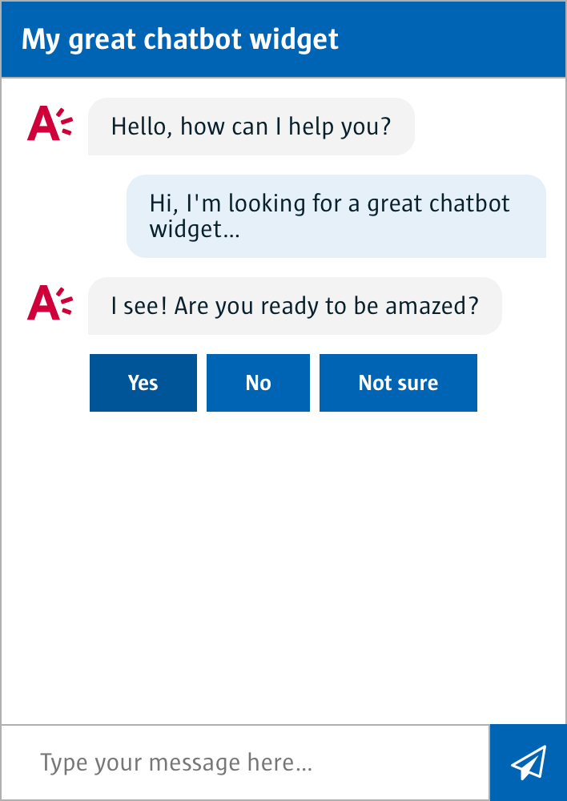

# Chatbot Smart Widget UI (AngularJS)

With the chatbot smart widget you can simply implement a chatbot in any page.

You will also need the BFF package in order to get the chatbot smart widget to work: [http://github.com/digipolisantwerp/chatbot_service_nodejs](http://github.com/digipolisantwerp/chatbot_service_nodejs)



There is a demo app, see below for instructions on running it.

## Changes

### v2.2.1

- fixed a possible empty URL message
- fixed an issue where the width was incorrectly set when the chatbot was not pinned.
- fixed an issue where the user's text was incorrectly alligned.

### v2.2.0

- updated the widget to the new design
- added avatar
- added `width` property to control the width of pinned chatbots

### v2.1.0

- fix dependencies

### v2.0.1

- fix issue with missing quickreplies

### v2.0.0

- adapted to chatbot_service_nodejs 2.x API
- added `initialmessage` property
- fixed missing `pinnedText` by renaming it to `pinnedtext`

> Migration note: if you want to use this with the v1 chatbot API, set the property `initialmessage=" "`.

### v1.0.2

- original release

## How to use

### Installing

To install this package use bower

`bower install 'https://github.com/digipolisantwerp/chatbot_widget_ng1.git#^2.x.x'`.

Include `akit.component.chatbotWidget` as module.

### In your template

```html
<aui-chatbot-widget
  url="http://localhost:3000/api/bff"
  session="123456789"
  title="My great chatbot widget"
  placeholder="Type your message here…"
  pinned="false"
  delay="200"
  height="400">
</aui-chatbot-widget>
```

### Supported attributes

#### **url**

`string` BFF URL.

#### **session**

`string` Required session ID for the chatbot engine, where each chat conversation is linked to its chat session. It's important to use a unique id, since all session data, like answers already given, are stored in the chatbot engine.

#### **title**

`string` Title above the chat window.

#### **pinned**

`boolean` Whether the chatbot is inline or pinned to the bottom of the application.

#### **placeholder**

`string` Placeholder string in the chat input field. Default: ""

#### **delay**

`number` Delay in ms between multiple messages received from the chatbot engine. Default: 400.

#### **height**

`number` Height of the chatbot in pixels. Default: 400.

#### **width**

`number` Width of the chatbot in pixels. Default: 288.

#### **avatar**

`string` Avatar image URL. Default is the special provided Antwerp icon.

#### **initialmessage**

`string` The message to send as an opening message (hidden). Defaults to `STARTCOMMANDO`.

#### **pinnedtext**

`string` The text shown on the pinned button. Default: "Een vraag stellen".

## Run the demo app

Run `npm install && bower install`.

Then run `gulp build && gulp serve`, then navigate to `./example/index.html' in the browser.

To interact with the chatbot widget you will have to set up the corresponding BFF service,
as well as adjust necessary parameters in `example/index.html`.

### Developing

Please refer to the [contributing guide](CONTRIBUTING.md).

## Contributing

Pull requests are always welcome, however keep the following things in mind:

- New features (both breaking and non-breaking) should always be discussed with the [repo's owner](#support). If possible, please open an issue first to discuss what you would like to change.
- Fork this repo and issue your fix or new feature via a pull request.
- Please make sure to update tests as appropriate. Also check possible linting errors and update the CHANGELOG if applicable.

## Support

Jasper Van Proeyen (<jasper.vanproeyen@digipolis.be>)
